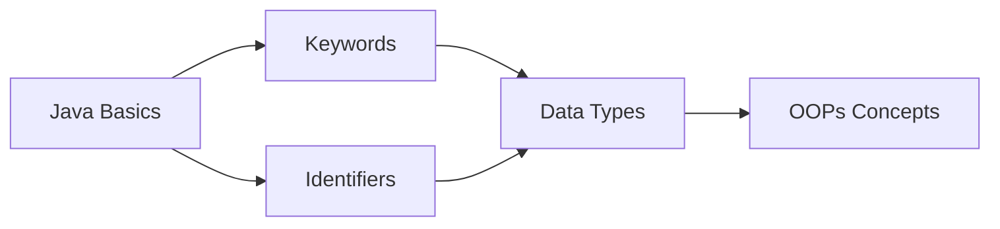

# Java Basics

Welcome to Java Basics! This section covers fundamental concepts of Java programming.

## What You'll Learn

This section introduces you to the core concepts of Java programming language:

- Understanding Java keywords and their usage
- Learning about identifiers and naming conventions
- Java syntax fundamentals
- Basic program structure

## Topics Covered

### [1. Keywords](keywords.md)
Learn about reserved words in Java that have special meanings and cannot be used as identifiers.

**Key Concepts:**
- What are keywords?
- List of all Java keywords
- Usage and examples
- Common mistakes to avoid

### [2. Identifiers](identifiers.md)
Understand how to name variables, methods, classes, and other program elements.

**Key Concepts:**
- Rules for creating identifiers
- Naming conventions
- Valid and invalid identifiers
- Best practices

## Getting Started

!!! tip "Prerequisites"
    Before diving into Java basics, ensure you have:
    - JDK (Java Development Kit) installed
    - A text editor or IDE (IntelliJ IDEA, Eclipse, VS Code)
    - Basic understanding of programming concepts

## Your First Java Program

Here's a simple "Hello World" program to get you started:

```java
public class HelloWorld {
    public static void main(String[] args) {
        System.out.println("Hello, World!");
    }
}
```

### Breaking Down the Code:

- `public class HelloWorld` - Declares a public class named HelloWorld
- `public static void main(String[] args)` - The main method, entry point of the program
- `System.out.println()` - Prints text to console

## Why Learn Java Basics?

Understanding the basics is crucial because:

1. **Foundation for Advanced Topics** - Everything in Java builds on these fundamentals
2. **Code Quality** - Proper naming and keyword usage leads to better code
3. **Industry Standards** - Following conventions makes your code professional
4. **Debugging** - Understanding basics helps identify and fix errors quickly

## Learning Path



## Quick Reference

| Topic | Description |
|-------|-------------|
| Keywords | 50+ reserved words in Java |
| Identifiers | Names for variables, classes, methods |
| Data Types | Types of data that can be stored |
| Operators | Symbols for performing operations |

## Practice Tips

!!! example "Hands-On Learning"
    The best way to learn Java basics is by writing code:
    - Write small programs using different keywords
    - Practice naming variables following conventions
    - Experiment with different data types
    - Make mistakes and learn from them

## Common Beginner Mistakes

1. **Using keywords as identifiers**
   ```java
   int class = 5;  // ❌ Wrong
   int className = 5; // ✅ Correct
   ```

2. **Incorrect naming conventions**
   ```java
   public class student { }  // ❌ Wrong
   public class Student { }  // ✅ Correct
   ```

3. **Missing semicolons**
   ```java
   System.out.println("Hello")  // ❌ Wrong
   System.out.println("Hello"); // ✅ Correct
   ```

## Next Steps

After completing Java Basics, you'll be ready to explore:

- Object-Oriented Programming (OOPs) concepts
- Exception Handling
- Collections Framework
- Advanced Java features

Start your journey by learning about [Java Keywords](keywords.md)!
