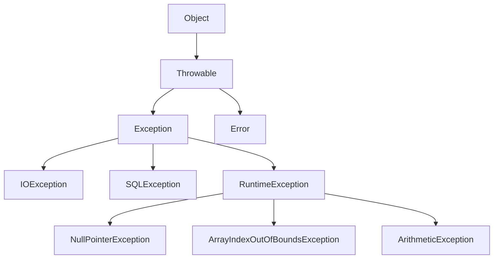
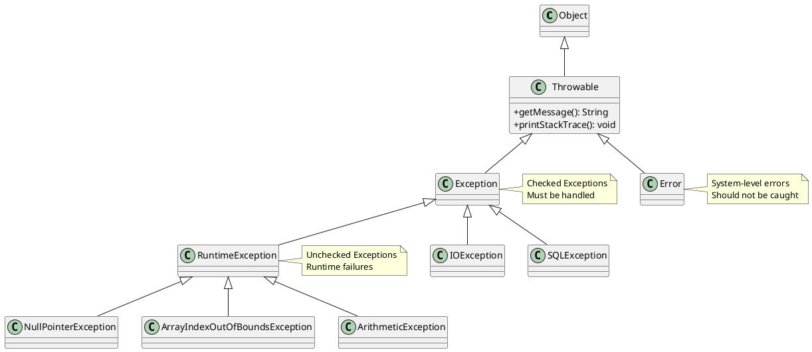
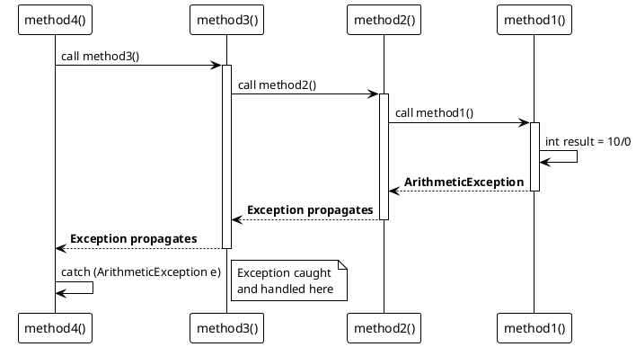

# Exception Handling

Learn how to handle errors and exceptions gracefully in Java applications.

## What is an Exception?

An exception is an unwanted or unexpected event that occurs during the execution of a program and disrupts its normal flow.

## Exception Hierarchy

### Using Mermaid Diagram



### Using PlantUML Diagram



## Types of Exceptions

### 1. Checked Exceptions
Checked at compile-time. Must be handled or declared.

```java
// Checked Exception Example
public void readFile(String fileName) throws IOException {
    FileReader file = new FileReader(fileName);
    BufferedReader reader = new BufferedReader(file);
    // Read file
}
```

### 2. Unchecked Exceptions (Runtime Exceptions)
Not checked at compile-time.

```java
// Unchecked Exception Example
public int divide(int a, int b) {
    return a / b;  // May throw ArithmeticException
}

int result = divide(10, 0);  // Throws ArithmeticException at runtime
```

### 3. Errors
Serious problems that applications shouldn't try to catch.

```java
// Error Example (don't catch these)
OutOfMemoryError
StackOverflowError
```

## Exception Handling Keywords

### try-catch Block

```java
try {
    // Code that may throw exception
    int result = 10 / 0;
} catch (ArithmeticException e) {
    // Handle exception
    System.out.println("Cannot divide by zero: " + e.getMessage());
}
```

### Multiple catch Blocks

```java
try {
    int[] arr = new int[5];
    arr[10] = 50;  // ArrayIndexOutOfBoundsException
    int result = 10 / 0;  // ArithmeticException
} catch (ArrayIndexOutOfBoundsException e) {
    System.out.println("Array index error: " + e.getMessage());
} catch (ArithmeticException e) {
    System.out.println("Math error: " + e.getMessage());
} catch (Exception e) {
    System.out.println("General error: " + e.getMessage());
}
```

### try-catch-finally

```java
FileReader file = null;
try {
    file = new FileReader("data.txt");
    // Read file
} catch (IOException e) {
    System.out.println("Error reading file: " + e.getMessage());
} finally {
    // Always executed - clean up resources
    if (file != null) {
        try {
            file.close();
        } catch (IOException e) {
            e.printStackTrace();
        }
    }
}
```

### try-with-resources (Java 7+)

Automatically closes resources.

```java
// Automatic resource management
try (FileReader file = new FileReader("data.txt");
     BufferedReader reader = new BufferedReader(file)) {

    String line = reader.readLine();
    System.out.println(line);

} catch (IOException e) {
    System.out.println("Error: " + e.getMessage());
}
// No finally needed - resources auto-closed
```

## Throwing Exceptions

### throw Keyword

```java
public void checkAge(int age) {
    if (age < 18) {
        throw new IllegalArgumentException("Age must be 18 or above");
    }
    System.out.println("Access granted");
}
```

### throws Keyword

```java
public void readFile(String fileName) throws IOException {
    FileReader file = new FileReader(fileName);
    // Method declares it may throw IOException
}

// Caller must handle it
public void processFile() {
    try {
        readFile("data.txt");
    } catch (IOException e) {
        e.printStackTrace();
    }
}
```

## Custom Exceptions

Create your own exception classes:

```java
// Custom checked exception
public class InsufficientFundsException extends Exception {
    private double amount;

    public InsufficientFundsException(double amount) {
        super("Insufficient funds: " + amount);
        this.amount = amount;
    }

    public double getAmount() {
        return amount;
    }
}

// Usage
public class BankAccount {
    private double balance;

    public void withdraw(double amount) throws InsufficientFundsException {
        if (amount > balance) {
            throw new InsufficientFundsException(amount - balance);
        }
        balance -= amount;
    }
}

// Using the custom exception
public class Main {
    public static void main(String[] args) {
        BankAccount account = new BankAccount();
        try {
            account.withdraw(500);
        } catch (InsufficientFundsException e) {
            System.out.println(e.getMessage());
            System.out.println("Short by: $" + e.getAmount());
        }
    }
}
```

## Common Exceptions

| Exception | Description | Example |
|-----------|-------------|---------|
| `NullPointerException` | Accessing null object | `String s = null; s.length();` |
| `ArrayIndexOutOfBoundsException` | Invalid array index | `int[] arr = new int[5]; arr[10] = 1;` |
| `ArithmeticException` | Math errors | `int x = 10 / 0;` |
| `NumberFormatException` | Invalid number conversion | `Integer.parseInt("abc");` |
| `IOException` | I/O operation failed | File operations |
| `SQLException` | Database error | Database operations |
| `ClassNotFoundException` | Class not found | `Class.forName("NonExistent");` |

## Best Practices

!!! tip "Exception Handling Best Practices"
    1. **Catch specific exceptions** - Don't catch generic Exception
    2. **Don't catch Throwable** - Too broad
    3. **Use finally or try-with-resources** - Clean up resources
    4. **Don't ignore exceptions** - Always handle or log
    5. **Create meaningful custom exceptions** - Make debugging easier
    6. **Don't use exceptions for flow control** - Use conditionals instead

### Good Practice ✅

```java
public void processData(String data) {
    try {
        // Process data
        int value = Integer.parseInt(data);
        // More processing
    } catch (NumberFormatException e) {
        logger.error("Invalid number format: " + data, e);
        throw new DataProcessingException("Invalid data format", e);
    } finally {
        // Clean up
    }
}
```

### Bad Practice ❌

```java
// Don't do this!
try {
    // Some code
} catch (Exception e) {
    // Empty catch block - swallows exception
}

// Or this
try {
    // Some code
} catch (Throwable t) {
    // Too broad - catches errors too
}

// Or this
public void process() throws Exception {
    // Too generic
}
```

## Exception Propagation

```java
public class ExceptionPropagation {
    // Exception occurs here
    public void method1() {
        int result = 10 / 0;  // ArithmeticException
    }

    // Exception propagates to method2
    public void method2() {
        method1();  // Exception not handled here
    }

    // Exception propagates to method3
    public void method3() {
        method2();  // Exception not handled here
    }

    // Finally caught here
    public void method4() {
        try {
            method3();
        } catch (ArithmeticException e) {
            System.out.println("Exception caught: " + e.getMessage());
        }
    }
}
```

### Exception Flow Diagram



## Chained Exceptions

```java
try {
    // Some operation
    throw new IOException("Database connection failed");
} catch (IOException e) {
    // Wrap and rethrow with more context
    throw new RuntimeException("Failed to process request", e);
}

// Accessing the chain
catch (RuntimeException e) {
    System.out.println("Main cause: " + e.getCause());
    e.printStackTrace();
}
```

## Real-World Example

```java
public class UserService {
    private Database database;
    private Logger logger;

    public User getUserById(int userId) {
        try {
            // Validate input
            if (userId <= 0) {
                throw new IllegalArgumentException("Invalid user ID: " + userId);
            }

            // Connect to database
            Connection conn = database.getConnection();

            try (PreparedStatement stmt = conn.prepareStatement(
                    "SELECT * FROM users WHERE id = ?")) {

                stmt.setInt(1, userId);
                ResultSet rs = stmt.executeQuery();

                if (rs.next()) {
                    return new User(
                        rs.getInt("id"),
                        rs.getString("name"),
                        rs.getString("email")
                    );
                } else {
                    throw new UserNotFoundException("User not found: " + userId);
                }

            } catch (SQLException e) {
                logger.error("Database error while fetching user: " + userId, e);
                throw new DataAccessException("Failed to fetch user", e);
            }

        } catch (IllegalArgumentException e) {
            logger.warn("Invalid request: " + e.getMessage());
            throw e;
        } catch (DataAccessException e) {
            logger.error("Data access failed", e);
            throw new ServiceException("Unable to retrieve user", e);
        }
    }
}
```

## Summary

| Concept | Description |
|---------|-------------|
| **Exception** | Event that disrupts normal program flow |
| **try-catch** | Handle exceptions |
| **finally** | Always executed, for cleanup |
| **throw** | Manually throw an exception |
| **throws** | Declare exceptions a method may throw |
| **Custom Exceptions** | Create application-specific exceptions |

## Key Points

- ✅ Always handle or declare checked exceptions
- ✅ Use specific exception types
- ✅ Clean up resources in finally or try-with-resources
- ✅ Log exceptions with meaningful messages
- ✅ Create custom exceptions for business logic errors
- ❌ Don't catch generic Exception or Throwable
- ❌ Don't ignore exceptions (empty catch blocks)
- ❌ Don't use exceptions for normal flow control

## Next Steps

Learn more about:
- Java Collections Framework
- Multithreading and Concurrency
- File I/O operations
- JDBC and database operations
