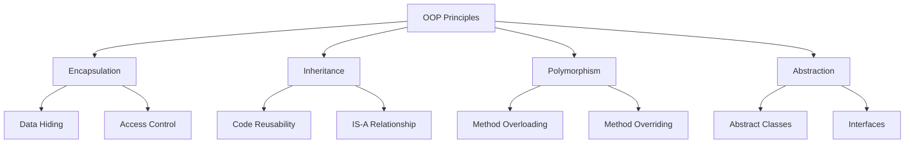

# Object-Oriented Programming (OOPs)

Learn the fundamental concepts of Object-Oriented Programming in Java.

## What is OOP?

Object-Oriented Programming (OOP) is a programming paradigm that organizes code around objects rather than functions and logic. Java is a fully object-oriented programming language.

## Core OOP Concepts

### 1. Class and Object

**Class** - A blueprint or template for creating objects.

**Object** - An instance of a class.

```java
// Class definition
public class Car {
    // Properties (attributes)
    String brand;
    String model;
    int year;

    // Method (behavior)
    public void start() {
        System.out.println("Car is starting...");
    }
}

// Creating objects
Car myCar = new Car();
myCar.brand = "Toyota";
myCar.model = "Camry";
myCar.year = 2023;
myCar.start();
```

### 2. Encapsulation

Encapsulation is the bundling of data and methods that operate on that data within a single unit (class), and restricting direct access to some components.

```java
public class BankAccount {
    // Private variables (data hiding)
    private String accountNumber;
    private double balance;

    // Public methods to access private data
    public double getBalance() {
        return balance;
    }

    public void deposit(double amount) {
        if (amount > 0) {
            balance += amount;
        }
    }

    public void withdraw(double amount) {
        if (amount > 0 && amount <= balance) {
            balance -= amount;
        }
    }
}
```

**Benefits:**
- Data hiding and security
- Flexibility and maintainability
- Control over data

### 3. Inheritance

Inheritance allows a class to inherit properties and methods from another class.

```java
// Parent class (Superclass)
public class Animal {
    protected String name;

    public void eat() {
        System.out.println("This animal eats food");
    }

    public void sleep() {
        System.out.println("This animal sleeps");
    }
}

// Child class (Subclass)
public class Dog extends Animal {
    public void bark() {
        System.out.println("The dog barks");
    }

    @Override
    public void eat() {
        System.out.println("The dog eats dog food");
    }
}

// Usage
Dog myDog = new Dog();
myDog.name = "Buddy";
myDog.eat();    // Overridden method
myDog.sleep();  // Inherited method
myDog.bark();   // Own method
```

**Types of Inheritance in Java:**
- Single Inheritance
- Multilevel Inheritance
- Hierarchical Inheritance
- **Note:** Java doesn't support multiple inheritance with classes (but supports with interfaces)

### 4. Polymorphism

Polymorphism means "many forms" - the ability of an object to take many forms.

**Types:**

#### a) Compile-time Polymorphism (Method Overloading)

```java
public class Calculator {
    // Method overloading - same name, different parameters
    public int add(int a, int b) {
        return a + b;
    }

    public double add(double a, double b) {
        return a + b;
    }

    public int add(int a, int b, int c) {
        return a + b + c;
    }
}
```

#### b) Runtime Polymorphism (Method Overriding)

```java
public class Shape {
    public void draw() {
        System.out.println("Drawing a shape");
    }
}

public class Circle extends Shape {
    @Override
    public void draw() {
        System.out.println("Drawing a circle");
    }
}

public class Rectangle extends Shape {
    @Override
    public void draw() {
        System.out.println("Drawing a rectangle");
    }
}

// Usage
Shape shape1 = new Circle();
Shape shape2 = new Rectangle();

shape1.draw();  // Output: Drawing a circle
shape2.draw();  // Output: Drawing a rectangle
```

### 5. Abstraction

Abstraction hides complex implementation details and shows only essential features.

#### Using Abstract Classes

```java
public abstract class Vehicle {
    // Abstract method (no implementation)
    public abstract void start();

    // Concrete method
    public void stop() {
        System.out.println("Vehicle stopped");
    }
}

public class Car extends Vehicle {
    @Override
    public void start() {
        System.out.println("Car starts with key");
    }
}

public class Bike extends Vehicle {
    @Override
    public void start() {
        System.out.println("Bike starts with kick");
    }
}
```

#### Using Interfaces

```java
public interface Drawable {
    void draw();  // Abstract by default
}

public interface Colorable {
    void setColor(String color);
}

// Implementing multiple interfaces
public class Circle implements Drawable, Colorable {
    private String color;

    @Override
    public void draw() {
        System.out.println("Drawing Circle");
    }

    @Override
    public void setColor(String color) {
        this.color = color;
    }
}
```

## The Four Pillars of OOP



## Real-World Example

```java
// Complete OOP example
public abstract class Employee {
    private String name;
    private int id;
    private double baseSalary;

    public Employee(String name, int id, double baseSalary) {
        this.name = name;
        this.id = id;
        this.baseSalary = baseSalary;
    }

    // Encapsulation - getters and setters
    public String getName() {
        return name;
    }

    public double getBaseSalary() {
        return baseSalary;
    }

    // Abstraction - abstract method
    public abstract double calculateSalary();

    // Common method
    public void displayInfo() {
        System.out.println("Name: " + name);
        System.out.println("ID: " + id);
        System.out.println("Salary: " + calculateSalary());
    }
}

// Inheritance
public class FullTimeEmployee extends Employee {
    private double bonus;

    public FullTimeEmployee(String name, int id, double baseSalary, double bonus) {
        super(name, id, baseSalary);
        this.bonus = bonus;
    }

    @Override
    public double calculateSalary() {
        return getBaseSalary() + bonus;
    }
}

// Inheritance
public class PartTimeEmployee extends Employee {
    private int hoursWorked;
    private double hourlyRate;

    public PartTimeEmployee(String name, int id, int hours, double rate) {
        super(name, id, 0);
        this.hoursWorked = hours;
        this.hourlyRate = rate;
    }

    @Override
    public double calculateSalary() {
        return hoursWorked * hourlyRate;
    }
}

// Polymorphism in action
public class Main {
    public static void main(String[] args) {
        Employee emp1 = new FullTimeEmployee("John", 101, 50000, 5000);
        Employee emp2 = new PartTimeEmployee("Jane", 102, 160, 25);

        emp1.displayInfo();
        emp2.displayInfo();
    }
}
```

## Benefits of OOP

| Benefit | Description |
|---------|-------------|
| **Modularity** | Code is organized in self-contained objects |
| **Reusability** | Inheritance allows code reuse |
| **Flexibility** | Polymorphism allows objects to behave differently |
| **Maintainability** | Encapsulation makes code easier to maintain |
| **Security** | Data hiding protects sensitive information |

## Best Practices

!!! tip "Design Principles"
    - **SOLID Principles** - Follow SOLID principles for better design
    - **Composition over Inheritance** - Prefer composition when possible
    - **Interface Segregation** - Keep interfaces focused and small
    - **DRY (Don't Repeat Yourself)** - Avoid code duplication

!!! warning "Common Mistakes"
    - Overusing inheritance
    - Breaking encapsulation
    - Not using interfaces effectively
    - Creating god classes (classes that do too much)

## Quick Comparison

| Concept | Abstract Class | Interface |
|---------|---------------|-----------|
| Methods | Can have abstract and concrete | All methods abstract (Java 7) |
| Variables | Can have any type | Only static final |
| Multiple | No multiple inheritance | Can implement multiple |
| Constructor | Can have constructor | Cannot have constructor |
| Access Modifiers | Any access modifier | Public by default |

## Summary

OOP in Java is built on four main principles:

1. **Encapsulation** - Bundle data and methods, hide implementation
2. **Inheritance** - Reuse code through parent-child relationships
3. **Polymorphism** - Objects behave differently in different contexts
4. **Abstraction** - Hide complexity, show only essentials

## Next Topics

Continue learning about:
- Exception Handling in Java
- Collections Framework
- Multithreading
- Design Patterns
