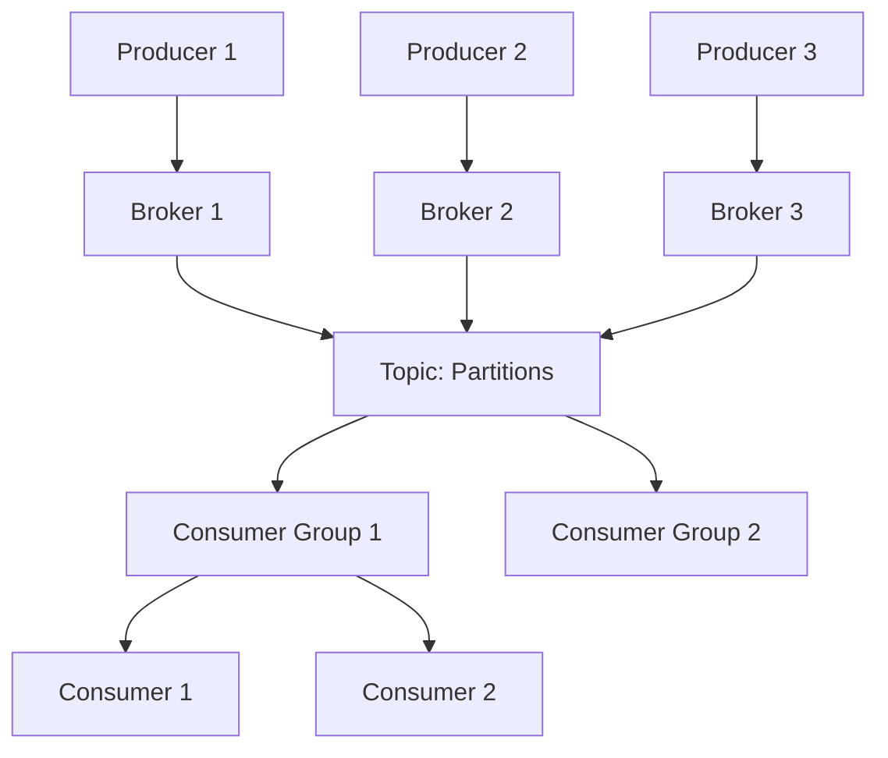

# Apache Kafka

Learn about Apache Kafka, a distributed event streaming platform used for building real-time data pipelines and streaming applications.

## What is Apache Kafka?

Apache Kafka is a distributed streaming platform that allows you to:

- **Publish and subscribe** to streams of records
- **Store** streams of records in a fault-tolerant way
- **Process** streams of records as they occur

## Core Concepts

### 1. Topics

A category or feed name to which records are published.

```
Topic: user-events
├── Partition 0: [msg1, msg2, msg3]
├── Partition 1: [msg4, msg5, msg6]
└── Partition 2: [msg7, msg8, msg9]
```

### 2. Partitions

Topics are split into partitions for parallelism and scalability.

### 3. Producers

Applications that publish (write) data to topics.

```java
@Service
public class KafkaProducerService {

    @Autowired
    private KafkaTemplate<String, String> kafkaTemplate;

    public void sendMessage(String topic, String message) {
        kafkaTemplate.send(topic, message);
    }

    public void sendWithKey(String topic, String key, String message) {
        kafkaTemplate.send(topic, key, message);
    }
}
```

### 4. Consumers

Applications that subscribe to (read) data from topics.

```java
@Service
public class KafkaConsumerService {

    @KafkaListener(topics = "user-events", groupId = "user-service")
    public void consume(String message) {
        System.out.println("Received message: " + message);
        // Process message
    }

    @KafkaListener(topics = "order-events", groupId = "order-service")
    public void consumeOrder(ConsumerRecord<String, String> record) {
        System.out.println("Key: " + record.key());
        System.out.println("Value: " + record.value());
        System.out.println("Partition: " + record.partition());
        System.out.println("Offset: " + record.offset());
    }
}
```

### 5. Consumer Groups

Group of consumers that cooperate to consume data from topics.

```
Topic: orders (3 partitions)

Consumer Group: order-processors
├── Consumer 1 → Partition 0
├── Consumer 2 → Partition 1
└── Consumer 3 → Partition 2
```

### 6. Brokers

Kafka servers that store data and serve clients.

### 7. ZooKeeper

Manages and coordinates Kafka brokers (being replaced by KRaft).

## Kafka Architecture



## Spring Boot Kafka Configuration

### Dependencies

```xml
<dependency>
    <groupId>org.springframework.kafka</groupId>
    <artifactId>spring-kafka</artifactId>
</dependency>
```

### application.properties

```properties
# Kafka Producer Configuration
spring.kafka.bootstrap-servers=localhost:9092
spring.kafka.producer.key-serializer=org.apache.kafka.common.serialization.StringSerializer
spring.kafka.producer.value-serializer=org.apache.kafka.common.serialization.StringSerializer
spring.kafka.producer.acks=all
spring.kafka.producer.retries=3

# Kafka Consumer Configuration
spring.kafka.consumer.bootstrap-servers=localhost:9092
spring.kafka.consumer.group-id=my-consumer-group
spring.kafka.consumer.key-deserializer=org.apache.kafka.common.serialization.StringDeserializer
spring.kafka.consumer.value-deserializer=org.apache.kafka.common.serialization.StringDeserializer
spring.kafka.consumer.auto-offset-reset=earliest
spring.kafka.consumer.enable-auto-commit=true
```

## Producer Example

### Simple Producer

```java
@RestController
@RequestMapping("/api/kafka")
public class KafkaController {

    @Autowired
    private KafkaTemplate<String, String> kafkaTemplate;

    @PostMapping("/publish")
    public ResponseEntity<String> publishMessage(
            @RequestParam String topic,
            @RequestParam String message) {

        kafkaTemplate.send(topic, message);
        return ResponseEntity.ok("Message published successfully");
    }
}
```

### Producer with Callback

```java
@Service
public class KafkaProducerService {

    @Autowired
    private KafkaTemplate<String, String> kafkaTemplate;

    private static final Logger logger = LoggerFactory.getLogger(KafkaProducerService.class);

    public void sendMessageWithCallback(String topic, String message) {
        ListenableFuture<SendResult<String, String>> future =
            kafkaTemplate.send(topic, message);

        future.addCallback(new ListenableFutureCallback<SendResult<String, String>>() {
            @Override
            public void onSuccess(SendResult<String, String> result) {
                logger.info("Message sent successfully: " + message);
                logger.info("Offset: " + result.getRecordMetadata().offset());
                logger.info("Partition: " + result.getRecordMetadata().partition());
            }

            @Override
            public void onFailure(Throwable ex) {
                logger.error("Failed to send message: " + message, ex);
            }
        });
    }
}
```

### Producer with Custom Object

```java
// Domain class
public class Order {
    private String orderId;
    private String customerId;
    private double amount;
    private LocalDateTime orderDate;

    // Constructors, getters, setters
}

// Producer configuration
@Configuration
public class KafkaProducerConfig {

    @Bean
    public ProducerFactory<String, Order> orderProducerFactory() {
        Map<String, Object> config = new HashMap<>();
        config.put(ProducerConfig.BOOTSTRAP_SERVERS_CONFIG, "localhost:9092");
        config.put(ProducerConfig.KEY_SERIALIZER_CLASS_CONFIG, StringSerializer.class);
        config.put(ProducerConfig.VALUE_SERIALIZER_CLASS_CONFIG, JsonSerializer.class);
        return new DefaultKafkaProducerFactory<>(config);
    }

    @Bean
    public KafkaTemplate<String, Order> orderKafkaTemplate() {
        return new KafkaTemplate<>(orderProducerFactory());
    }
}

// Producer service
@Service
public class OrderProducerService {

    @Autowired
    private KafkaTemplate<String, Order> kafkaTemplate;

    public void sendOrder(Order order) {
        kafkaTemplate.send("order-topic", order.getOrderId(), order);
    }
}
```

## Consumer Example

### Simple Consumer

```java
@Service
public class KafkaConsumerService {

    private static final Logger logger = LoggerFactory.getLogger(KafkaConsumerService.class);

    @KafkaListener(topics = "my-topic", groupId = "my-group")
    public void consume(String message) {
        logger.info("Consumed message: " + message);
    }
}
```

### Consumer with Error Handling

```java
@Service
public class KafkaConsumerService {

    private static final Logger logger = LoggerFactory.getLogger(KafkaConsumerService.class);

    @KafkaListener(topics = "order-topic", groupId = "order-group")
    public void consumeOrder(String order) {
        try {
            // Process order
            processOrder(order);
        } catch (Exception e) {
            logger.error("Error processing order: " + order, e);
            // Send to dead letter queue
            sendToDeadLetterQueue(order);
        }
    }

    private void processOrder(String order) {
        // Business logic
    }

    private void sendToDeadLetterQueue(String order) {
        // Send failed message to DLQ
    }
}
```

### Consumer with JSON Deserialization

```java
@Configuration
public class KafkaConsumerConfig {

    @Bean
    public ConsumerFactory<String, Order> orderConsumerFactory() {
        Map<String, Object> config = new HashMap<>();
        config.put(ConsumerConfig.BOOTSTRAP_SERVERS_CONFIG, "localhost:9092");
        config.put(ConsumerConfig.GROUP_ID_CONFIG, "order-group");
        config.put(ConsumerConfig.KEY_DESERIALIZER_CLASS_CONFIG, StringDeserializer.class);
        config.put(ConsumerConfig.VALUE_DESERIALIZER_CLASS_CONFIG, JsonDeserializer.class);
        config.put(JsonDeserializer.TRUSTED_PACKAGES, "*");
        config.put(JsonDeserializer.VALUE_DEFAULT_TYPE, Order.class);
        return new DefaultKafkaConsumerFactory<>(config);
    }

    @Bean
    public ConcurrentKafkaListenerContainerFactory<String, Order> orderKafkaListenerFactory() {
        ConcurrentKafkaListenerContainerFactory<String, Order> factory =
            new ConcurrentKafkaListenerContainerFactory<>();
        factory.setConsumerFactory(orderConsumerFactory());
        return factory;
    }
}

@Service
public class OrderConsumerService {

    @KafkaListener(
        topics = "order-topic",
        groupId = "order-group",
        containerFactory = "orderKafkaListenerFactory"
    )
    public void consumeOrder(Order order) {
        System.out.println("Received order: " + order.getOrderId());
        // Process order
    }
}
```

## Kafka Streams

Process data in real-time.

```java
@Configuration
@EnableKafkaStreams
public class KafkaStreamsConfig {

    @Bean
    public KStream<String, String> kStream(StreamsBuilder builder) {
        KStream<String, String> stream = builder.stream("input-topic");

        stream
            .filter((key, value) -> value.length() > 5)
            .mapValues(value -> value.toUpperCase())
            .to("output-topic");

        return stream;
    }
}
```

## Key Features

### 1. High Throughput

Handle millions of messages per second.

### 2. Scalability

Scale horizontally by adding brokers and partitions.

### 3. Durability

Data is persisted to disk and replicated.

### 4. Fault Tolerance

Replication ensures data availability.

```properties
# Replication factor
num.replica.fetchers=3
min.insync.replicas=2
```

### 5. Real-time Processing

Process data as it arrives.

## Use Cases

| Use Case | Description |
|----------|-------------|
| **Messaging** | Replace traditional message queues |
| **Activity Tracking** | Track user actions on websites |
| **Metrics** | Collect and aggregate metrics |
| **Log Aggregation** | Centralize logs from multiple services |
| **Stream Processing** | Real-time data processing |
| **Event Sourcing** | Store state changes as events |
| **Commit Log** | Distributed commit log for microservices |

## Best Practices

!!! tip "Kafka Best Practices"
    1. **Choose partition count carefully** - Based on throughput needs
    2. **Use appropriate replication factor** - At least 3 for production
    3. **Monitor lag** - Track consumer lag
    4. **Use consumer groups** - For parallel processing
    5. **Handle errors gracefully** - Implement retry and DLQ
    6. **Enable compression** - Reduce network bandwidth
    7. **Set retention policies** - Based on storage and needs
    8. **Use schemas** - Avro/Protobuf for data validation
    9. **Monitor performance** - Use Kafka metrics
    10. **Secure your cluster** - Enable authentication and encryption

## Common Patterns

### Event Sourcing

```java
@Service
public class OrderEventSourcing {

    @Autowired
    private KafkaTemplate<String, OrderEvent> kafkaTemplate;

    public void createOrder(Order order) {
        OrderEvent event = new OrderEvent("ORDER_CREATED", order);
        kafkaTemplate.send("order-events", event);
    }

    public void updateOrder(Order order) {
        OrderEvent event = new OrderEvent("ORDER_UPDATED", order);
        kafkaTemplate.send("order-events", event);
    }

    @KafkaListener(topics = "order-events", groupId = "order-processor")
    public void processOrderEvent(OrderEvent event) {
        switch (event.getEventType()) {
            case "ORDER_CREATED":
                handleOrderCreated(event.getOrder());
                break;
            case "ORDER_UPDATED":
                handleOrderUpdated(event.getOrder());
                break;
        }
    }
}
```

### CQRS (Command Query Responsibility Segregation)

```java
// Command side - writes to Kafka
@Service
public class OrderCommandService {
    @Autowired
    private KafkaTemplate<String, OrderCommand> kafkaTemplate;

    public void createOrder(OrderCommand command) {
        kafkaTemplate.send("order-commands", command);
    }
}

// Query side - reads from Kafka and updates read model
@Service
public class OrderQueryService {
    @Autowired
    private OrderReadRepository readRepository;

    @KafkaListener(topics = "order-events", groupId = "query-side")
    public void updateReadModel(OrderEvent event) {
        OrderReadModel model = buildReadModel(event);
        readRepository.save(model);
    }
}
```

## Monitoring

```properties
# Enable JMX metrics
jmx.port=9999

# Consumer lag monitoring
consumer.lag.threshold=1000
```

## Summary

Apache Kafka provides:

- ✅ High throughput and low latency
- ✅ Horizontal scalability
- ✅ Fault tolerance and durability
- ✅ Real-time stream processing
- ✅ Decoupling of services
- ✅ Event-driven architecture support

## Next Topics

- Kafka Connect
- Schema Registry
- ksqlDB
- Kafka Security (SSL, SASL)
- Kafka monitoring and operations
- Advanced stream processing
