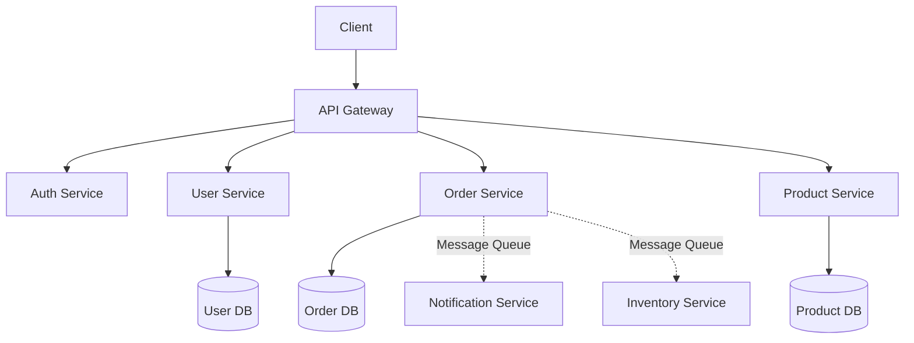

# Microservices

Learn about microservices architecture and how to build scalable, distributed applications.

## What are Microservices?

Microservices is an architectural style that structures an application as a collection of small, autonomous services that are:

- **Independently deployable**
- **Loosely coupled**
- **Organized around business capabilities**
- **Owned by small teams**

## Microservices vs Monolithic

| Aspect | Monolithic | Microservices |
|--------|-----------|---------------|
| **Architecture** | Single unit | Multiple services |
| **Deployment** | All together | Independent |
| **Scaling** | Scale entire app | Scale individual services |
| **Technology** | Single stack | Polyglot |
| **Development** | One team | Multiple teams |
| **Complexity** | Lower initially | Higher |

## Key Characteristics

### 1. Independent Deployment

Each microservice can be deployed independently without affecting others.

### 2. Decentralized Data Management

Each service owns its own database.

### 3. API Gateway

Single entry point for all clients.

```
Client → API Gateway → Service A
                     → Service B
                     → Service C
```

### 4. Service Discovery

Services can find each other dynamically.

### 5. Load Balancing

Distribute traffic across service instances.

## Common Patterns

### API Gateway Pattern

```java
@RestController
@RequestMapping("/api")
public class ApiGateway {
    @Autowired
    private UserServiceClient userService;

    @Autowired
    private OrderServiceClient orderService;

    @GetMapping("/user-orders/{userId}")
    public UserOrdersDTO getUserWithOrders(@PathVariable Long userId) {
        User user = userService.getUser(userId);
        List<Order> orders = orderService.getUserOrders(userId);
        return new UserOrdersDTO(user, orders);
    }
}
```

### Circuit Breaker Pattern

Prevents cascading failures.

```java
@Service
public class UserService {
    @CircuitBreaker(name = "userService", fallbackMethod = "fallbackGetUser")
    public User getUser(Long id) {
        return restTemplate.getForObject(
            "http://user-service/api/users/" + id,
            User.class
        );
    }

    public User fallbackGetUser(Long id, Exception ex) {
        return new User(id, "Fallback User", "fallback@example.com");
    }
}
```

### Service Registry Pattern

Services register themselves for discovery.

```java
@EnableEurekaClient
@SpringBootApplication
public class UserServiceApplication {
    public static void main(String[] args) {
        SpringApplication.run(UserServiceApplication.class, args);
    }
}
```

## Technologies & Tools

| Category | Tools |
|----------|-------|
| **Service Discovery** | Eureka, Consul, Zookeeper |
| **API Gateway** | Spring Cloud Gateway, Netflix Zuul |
| **Load Balancing** | Ribbon, Spring Cloud LoadBalancer |
| **Circuit Breaker** | Resilience4j, Hystrix |
| **Configuration** | Spring Cloud Config, Consul |
| **Monitoring** | Prometheus, Grafana, ELK Stack |
| **Tracing** | Zipkin, Jaeger |
| **Messaging** | RabbitMQ, Apache Kafka |
| **Containers** | Docker, Kubernetes |

## Communication

### Synchronous (REST)

```java
@FeignClient(name = "user-service")
public interface UserClient {
    @GetMapping("/api/users/{id}")
    User getUser(@PathVariable Long id);
}
```

### Asynchronous (Messaging)

```java
@Service
public class OrderService {
    @Autowired
    private KafkaTemplate<String, Order> kafkaTemplate;

    public void createOrder(Order order) {
        // Save order
        orderRepository.save(order);

        // Publish event
        kafkaTemplate.send("order-created", order);
    }
}

@Service
public class InventoryService {
    @KafkaListener(topics = "order-created")
    public void handleOrderCreated(Order order) {
        // Update inventory
        inventoryService.updateStock(order);
    }
}
```

## Best Practices

!!! tip "Microservices Best Practices"
    1. **Single Responsibility** - One service, one business capability
    2. **Decentralize Data** - Each service owns its database
    3. **API Versioning** - Version your APIs
    4. **Health Checks** - Implement health endpoints
    5. **Logging** - Centralized logging
    6. **Monitoring** - Track metrics and traces
    7. **Security** - Use OAuth2/JWT
    8. **CI/CD** - Automate deployments
    9. **Testing** - Unit, integration, and contract tests
    10. **Documentation** - Document APIs (Swagger/OpenAPI)

## Challenges

| Challenge | Solution |
|-----------|----------|
| **Distributed Data** | SAGA pattern, Event Sourcing |
| **Network Issues** | Circuit breaker, Retry logic |
| **Service Discovery** | Service registry (Eureka, Consul) |
| **Monitoring** | Distributed tracing (Zipkin, Jaeger) |
| **Debugging** | Centralized logging (ELK Stack) |
| **Testing** | Contract testing (Pact) |

## Example Architecture



## Summary

Microservices provide:

- ✅ Independent deployment and scaling
- ✅ Technology flexibility
- ✅ Fault isolation
- ✅ Team autonomy
- ⚠️ Increased complexity
- ⚠️ Distributed system challenges

## Next Topics

- Service mesh (Istio, Linkerd)
- Event-driven architecture
- CQRS and Event Sourcing
- Kubernetes orchestration
- DevOps practices for microservices
